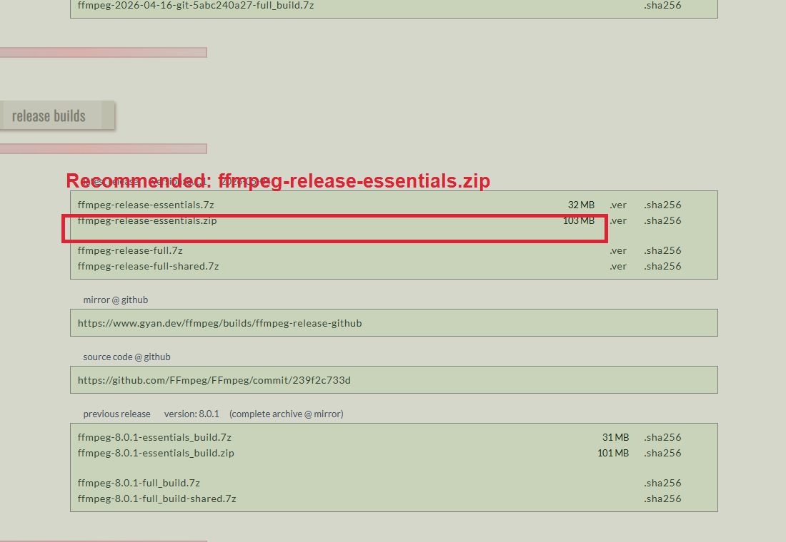

# MoReng Subtitle Maker

MoReng Subtitle Maker는 머니체크가 만든 로컬 자막 도구입니다. MP4/MP3 파일에서 SRT/TXT 자막을 생성하고, 사용자의 Gemini API Key로 다국어 SRT 번역을 지원합니다.

이 저장소는 MoReng Subtitle Maker 전용 저장소입니다. 기존 모랭 랜딩페이지/본체 저장소인 `suhoahbi-ui/moreng`은 이 작업에서 수정하지 않습니다. 나중에 모랭 랜딩페이지에 붙일 소개 문구는 [docs/landing-copy.md](docs/landing-copy.md)에 따로 정리했습니다.

제품 정보:

- Product: MoReng Subtitle Maker / 모랭 자막 메이커
- Created by: MoneyCheck / 머니체크
- GitHub: https://github.com/suhoahbi-ui/moreng-subtitle-maker
- Contact: moneychecktruck@gmail.com

## 1. MoReng Subtitle Maker 소개

MoReng Subtitle Maker는 강의, 인터뷰, 유튜브 롱폼 영상, 녹음파일을 위한 로컬 자막 생성 도구입니다.

- 영문명: MoReng Subtitle Maker
- 한글명: 모랭 자막 메이커
- 제작: MoneyCheck / 머니체크
- 앱 저장소: https://github.com/suhoahbi-ui/moreng-subtitle-maker
- 문의: moneychecktruck@gmail.com

영상/오디오 파일은 외부 서버로 업로드되지 않습니다. 음성 인식은 사용자의 PC에서 실행됩니다. 단, 번역 기능을 사용할 경우 SRT의 자막 텍스트는 Gemini API로 전송됩니다.

## 2. 주요 기능

- MP4/MP3 파일 선택
- 원본 언어 선택: 자동감지, 한국어, 영어, 일본어, 중국어
- Whisper 모델 선택: `small`, `medium`, `large-v3`
- ffmpeg를 이용한 오디오 추출
- faster-whisper 기반 SRT/TXT 생성
- Gemini API Key 마스킹 입력
- API Key 저장/삭제
- keyring 기반 로컬 저장, 실패 시 로컬 파일 fallback
- SRT 번호와 시간 코드를 유지한 번역
- 영어/일본어/중국어/베트남어 번역 SRT 생성
- 진행 상태와 사용자용 로그 표시

이번 버전에는 영상에 자막을 입힌 MP4 렌더링, 쇼츠 자동 편집, 로그인/회원가입, 결제 기능이 포함되어 있지 않습니다.

## 3. 설치 전 필독

처음 실행하기 전 [설치전_필독.txt](설치전_필독.txt)를 먼저 읽어주세요.

핵심은 세 가지입니다.

- MP4/MP3에서 오디오를 추출하려면 ffmpeg가 필요합니다.
- ffmpeg는 앱에 포함되어 있지 않습니다.
- Gemini 번역 기능을 쓰려면 사용자가 직접 발급한 Gemini API Key가 필요합니다.

## 4. ffmpeg 안내

이 앱은 MP4/MP3에서 오디오를 추출하기 위해 ffmpeg와 ffprobe를 사용합니다.

### 왜 ffmpeg를 앱에 포함하지 않나요?

ffmpeg 실행 파일은 앱에 직접 포함하지 않습니다. 대신 사용자가 공식 또는 신뢰 가능한 페이지에서 직접 다운로드하도록 안내합니다.

이 방식을 쓰는 이유:

1. ffmpeg는 LGPL/GPL 라이선스 조건이 적용될 수 있어 직접 포함 배포 시 별도 라이선스 고지와 배포 조건 확인이 필요합니다.
2. 사용자가 공식/신뢰 가능한 페이지에서 직접 받도록 안내하면 변조 파일 배포 위험을 줄일 수 있습니다.
3. 보안 프로그램이 외부 exe 파일이 포함된 배포판을 의심하는 경우를 줄일 수 있습니다.
4. 사용자가 최신 Windows용 ffmpeg를 직접 선택해 설치할 수 있습니다.

참고 링크:

- [FFmpeg 공식 다운로드 페이지](https://ffmpeg.org/download.html)
- [Windows용 FFmpeg 빌드](https://www.gyan.dev/ffmpeg/builds/)
- [FFmpeg License and Legal Considerations](https://www.ffmpeg.org/legal.html)

### 자동 확인 방식

`run_windows.bat`를 실행하면 ffmpeg 설치 여부를 확인합니다.

ffmpeg가 이미 설치되어 있으면 바로 앱을 실행합니다. ffmpeg가 없으면 아래 선택지가 나옵니다.

```text
1. winget으로 ffmpeg 설치 후 계속
2. 다운로드 페이지 열기
3. 일단 앱 실행
```

### winget 설치

PowerShell 또는 `run_windows.bat`의 선택지에서 설치할 수 있습니다.

```powershell
winget install Gyan.FFmpeg
```

설치 후 새 PowerShell에서 확인합니다.

```powershell
ffmpeg -version
ffprobe -version
```

### 수동 설치

ffmpeg를 Windows 전체에 설치하지 않고 앱 폴더에만 넣어도 됩니다.

1. [Windows용 FFmpeg 빌드](https://www.gyan.dev/ffmpeg/builds/) 페이지를 엽니다.
2. `release builds` 섹션을 찾습니다.
3. 일반 사용자는 `ffmpeg-release-essentials.zip`을 다운로드하는 것을 권장합니다.



선택 기준:

| 항목 | 선택 여부 | 이유 |
| --- | --- | --- |
| `ffmpeg-release-essentials.zip` | 권장 | Windows 기본 압축 풀기로 열 수 있고, 이 앱에 필요한 `ffmpeg.exe`, `ffprobe.exe`가 들어 있습니다. |
| `ffmpeg-release-essentials.7z` | 선택 가능 | 용량은 작지만 7-Zip 같은 별도 압축 프로그램이 필요할 수 있습니다. |
| `ffmpeg-release-full.7z` | 보통 불필요 | 더 많은 기능이 들어 있지만 MP4/MP3 오디오 추출에는 보통 필요하지 않습니다. |
| `ffmpeg-release-full-shared.7z` | 비추천 | 개발/특수 용도에 가깝습니다. |
| `ffmpeg-git-*` | 비추천 | 최신 개발 빌드라 일반 사용자 안내에는 덜 적합합니다. |
| `ffmpeg-tools.zip` | 비추천 | ffmpeg 본체가 아니라 보조 도구 묶음입니다. |

4. 다운로드한 ZIP 압축을 풉니다.
5. 압축을 푼 폴더 안의 `bin` 폴더에서 아래 두 파일을 찾습니다.

```text
ffmpeg.exe
ffprobe.exe
```

`ffplay.exe`가 같이 있어도 MoReng Subtitle Maker에는 필요하지 않습니다.

6. 두 파일을 아래 폴더에 넣습니다.

```text
tools\ffmpeg\bin\
```

앱은 실행 시 `tools\ffmpeg\bin\`을 먼저 확인하고, 없으면 앱 루트 폴더, 그 다음 Windows PATH를 확인합니다.

## 5. 실행 방법

### GitHub Releases ZIP 다운로드 후 실행

일반 사용자는 GitHub Releases에서 Windows ZIP 파일을 다운로드해 실행할 수 있습니다.

1. GitHub Releases에서 `MoReng-Subtitle-Maker-v0.1.0-windows.zip`을 다운로드합니다.
2. 원하는 폴더에 압축을 풉니다.
3. 압축을 푼 폴더 안의 `설치전_필독.txt`를 먼저 읽습니다.
4. `run_windows.bat`를 더블클릭합니다.
5. ffmpeg가 없으면 안내에 따라 설치하거나 수동 다운로드합니다.
6. 처음 실행 시 Python 가상환경과 필요한 패키지가 설치됩니다.

이 ZIP 배포판에는 `ffmpeg.exe`, `ffprobe.exe`, Gemini API Key, 샘플 미디어 파일이 포함되어 있지 않습니다.

### 개발 폴더에서 실행

가장 쉬운 방법은 `run_windows.bat`를 더블클릭하는 것입니다.

처음 실행하면 다음 작업을 진행합니다.

1. ffmpeg 설치 여부 확인
2. Python 가상환경 `.venv` 생성
3. 필요한 패키지 설치
4. 앱 실행

ffmpeg 설치부터 먼저 하고 싶으면 `install_ffmpeg_then_run.bat`를 실행하세요.

수동 실행:

```powershell
py -3 -m venv .venv
.\.venv\Scripts\activate
python -m pip install --upgrade pip
python -m pip install -r requirements.txt
python app.py
```

Python 3.10 이상을 권장합니다.

```powershell
py --version
```

### 릴리스 ZIP 직접 만들기

저장소를 clone한 개발자는 아래 명령으로 GitHub Releases에 올릴 ZIP 파일을 만들 수 있습니다.

```powershell
python scripts/make_release_zip.py
```

생성 위치:

```text
dist/MoReng-Subtitle-Maker-v0.1.0-windows.zip
```

## 6. Gemini API Key 설정

Gemini 번역 기능을 사용하려면 사용자가 직접 Gemini API Key를 발급해야 합니다.

중요 안내:

- API Key는 사용자가 직접 발급해야 합니다.
- API Key는 사용자의 PC에 저장됩니다.
- API Key는 머니체크 서버로 전송되지 않습니다.
- 앱에는 머니체크의 공용 Gemini API Key가 들어있지 않습니다.
- 입력창은 비밀번호처럼 마스킹됩니다.
- 저장 후에도 실제 키는 화면에 표시되지 않고 `저장됨 (********)` 상태로만 표시됩니다.
- 사용자는 언제든지 저장된 API Key를 삭제할 수 있습니다.
- Gemini API 사용량, 요금, 제한, 오류, 번역 품질에 대한 책임은 사용자에게 있습니다.

앱에서 설정하는 방법:

1. `Gemini API Key` 입력창에 키를 붙여넣습니다.
2. `저장`을 누릅니다.
3. 상태가 `저장됨 (********)`으로 바뀌는지 확인합니다.
4. 키를 지우려면 `삭제`를 누릅니다.

## 7. SRT/TXT 생성 방법

1. `파일 선택`을 눌러 MP4 또는 MP3 파일을 선택합니다.
2. 출력 폴더를 선택합니다. 선택하지 않으면 원본 파일과 같은 폴더에 저장됩니다.
3. 원본 언어를 선택합니다. 기본값은 `자동감지`입니다.
4. Whisper 모델을 선택합니다.
5. `자막 생성`을 누릅니다.

모델 선택 기준:

| 모델 | 추천 상황 | 설명 |
| --- | --- | --- |
| `small` | 빠른 테스트 | 빠르고 가볍지만 오타가 더 생길 수 있습니다. |
| `medium` | 기본 추천 | 속도와 품질의 균형이 좋습니다. |
| `large-v3` | 품질 우선 | 더 정확할 수 있지만 느리고 PC 성능을 많이 사용합니다. |

처음 실행할 때는 선택한 Whisper 모델을 다운로드하므로 시간이 걸릴 수 있습니다.

## 8. 번역 SRT 생성 방법

1. 원본 SRT 파일을 선택합니다.
2. 번역 언어를 선택합니다.
3. Gemini API Key가 저장되어 있는지 확인합니다.
4. `번역 SRT 생성`을 누릅니다.

번역 방식:

- 원본 SRT의 번호는 바꾸지 않습니다.
- 원본 SRT의 시간 코드는 바꾸지 않습니다.
- 자막 텍스트만 Gemini API로 번역합니다.
- 번역 실패 블록은 원문을 유지하고 로그 파일을 남깁니다.
- Gemini 모델 혼잡, 일시적 서버 오류, 요청 제한이 의심되는 경우에는 자동으로 몇 차례 재시도합니다.

번역 기능을 사용할 경우 SRT 자막 텍스트는 Gemini API로 전송됩니다.

## 9. 파일은 어디에 저장되나요?

기본값은 원본 파일과 같은 폴더입니다. 앱에서 출력 폴더를 선택하면 해당 폴더에 저장됩니다.

출력 예:

```text
sample.ko.srt
sample.ko.txt
sample.en.srt
sample.ja.srt
sample.zh.srt
sample.vi.srt
```

자동감지 결과를 알 수 없으면 언어 코드 없이 `sample.srt`, `sample.txt`처럼 저장될 수 있습니다.

## 10. 개인정보/보안 안내

- 영상/오디오 파일은 외부 서버로 업로드되지 않습니다.
- 음성 인식은 사용자의 PC에서 로컬로 실행됩니다.
- 번역 기능을 사용할 경우 SRT의 자막 텍스트는 Gemini API로 전송됩니다.
- Gemini API Key는 사용자의 PC에 저장됩니다.
- Gemini API Key는 머니체크 서버로 전송되지 않습니다.
- 앱에는 머니체크의 공용 Gemini API Key가 포함되어 있지 않습니다.
- API Key는 화면에 평문으로 표시되지 않습니다.
- 저장된 API Key는 앱에서 삭제할 수 있습니다.

## 11. 책임 고지

이 도구는 사용자의 로컬 PC에서 자막 생성과 번역을 돕기 위한 보조 도구입니다.

사용자는 본인의 책임 하에 파일과 API Key를 관리해야 하며, Gemini API 사용량, 과금, 번역 결과, 저작권이 있는 콘텐츠의 사용 가능 여부는 직접 확인해야 합니다.

머니체크는 사용자의 API Key, Gemini API 사용량과 과금, 제3자 콘텐츠 사용, 자동 생성/자동 번역 결과의 정확성에 대해 책임을 지지 않습니다.

자세한 내용은 [DISCLAIMER.md](DISCLAIMER.md)를 확인해주세요.

## 12. 자주 묻는 질문

### Q. 영상 파일이 머니체크 서버로 올라가나요?

아니요. 영상/오디오 파일은 사용자의 PC에서 처리됩니다.

### Q. Gemini API Key가 머니체크로 전송되나요?

아니요. API Key는 사용자의 PC에 저장되며 머니체크 서버로 전송되지 않습니다.

### Q. 번역할 때 어떤 데이터가 전송되나요?

번역 기능 사용 시 SRT의 자막 텍스트가 Gemini API로 전송됩니다.

### Q. ffmpeg가 왜 포함되어 있지 않나요?

ffmpeg는 LGPL/GPL 라이선스 조건이 적용될 수 있어 앱에 직접 포함하지 않고, 사용자가 공식 또는 신뢰 가능한 페이지에서 설치하도록 안내합니다.

### Q. Gemini API 사용료가 발생할 수 있나요?

사용자의 Google/Gemini 계정 정책과 사용량에 따라 달라질 수 있습니다. 사용자는 본인의 API 사용량을 직접 확인해야 합니다.

### Q. 영어 번역 중 `503 UNAVAILABLE` 또는 `high demand`가 나오면 어떻게 하나요?

Gemini 모델이 일시적으로 혼잡하다는 뜻입니다. 앱은 자동으로 몇 차례 기다렸다가 다시 시도합니다. 계속 실패하면 잠시 후 다시 실행하거나 Google/Gemini 사용량 제한 상태를 확인해주세요.

### Q. 번역 결과를 그대로 써도 되나요?

자동 번역 결과는 검토 후 사용하는 것을 권장합니다.

### Q. SRT에서 틀린 글자는 어디서 고치나요?

SRT 파일은 텍스트 파일입니다. 메모장, VS Code, Notepad++, Subtitle Edit 등에서 열고 번호와 시간 코드는 그대로 둔 채 자막 문장만 수정하면 됩니다.

## 13. 문의

moneychecktruck@gmail.com

## 14. 라이선스

이 프로젝트의 자체 코드는 MIT License를 기본 라이선스로 둡니다. 자세한 내용은 [LICENSE](LICENSE)를 확인해주세요.

주의: ffmpeg는 이 앱에 포함되어 있지 않습니다. 사용자가 직접 설치해야 하며, ffmpeg의 라이선스 조건은 ffmpeg 배포본과 빌드 옵션에 따라 달라질 수 있습니다.

배포 전 주요 의존성 고지는 [THIRD_PARTY_NOTICES.md](THIRD_PARTY_NOTICES.md)도 함께 확인해주세요.

## 15. 주요 의존성

| 의존성 | 용도 | 라이선스/주의 |
| --- | --- | --- |
| faster-whisper | 로컬 음성 인식 | MIT License. OpenAI Whisper 모델을 CTranslate2 기반으로 빠르게 실행합니다. |
| OpenAI Whisper 모델 | 음성 인식 모델 | OpenAI Whisper 코드와 모델 가중치는 MIT License로 공개되어 있습니다. |
| google-genai | Gemini API 호출 | Apache-2.0 License. Gemini API 사용은 Google/Gemini 정책을 따릅니다. |
| keyring | API Key 로컬 저장 | MIT License 계열로 배포되는 Python keyring 라이브러리입니다. |
| ffmpeg/ffprobe | MP4/MP3 오디오 추출 | 앱에 포함하지 않습니다. FFmpeg는 LGPL/GPL 조건이 적용될 수 있습니다. |
| Tkinter | GUI | Python 표준 라이브러리 GUI입니다. |

참고 링크:

- [faster-whisper](https://github.com/SYSTRAN/faster-whisper)
- [OpenAI Whisper](https://github.com/openai/whisper)
- [Google Gen AI Python SDK](https://github.com/googleapis/python-genai)
- [FFmpeg Legal](https://www.ffmpeg.org/legal.html)
